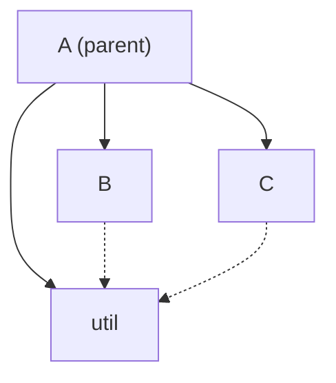

title: Applying Zettelkasten to programming
summary: Moving away from hierarchical code organization
date: 2025-06-08 12:00
tags: thought
---

As any programmer will tell you, code organization is paramount for any
non-trivial project. When our code grows too big for a single file, we split it
up into multiple ones. When we have too many files, we put them into folders.
When we have too many folders, we put them in _more_ folders ad infinitum. This
hierarchy strongly shapes a project's structure and maintainability.

Tree hierarchies feel quite natural. They conceptually fit with abstraction,
where parent modules abstract the capabilities of their children. It's also easy
to implement, leveraging the filesystem for most of the work. But how does it
work in practice?

## Siblings and permissions

Having private utilities is a core piece of encapsulation; we carefully control the surface area exposed to the public. If a single module needs a private utility this is fairly straightforward, but often we need multiple modules to have access to the same internal operations. In basically every language, we end up doing this by creating a semi-public sibling module.



This causes two problems:

- `util` is now public to the rest of our application
- **The folder structure no longer represents our architecture**

While this simple example is still understandable, over time this conflict leads to gradual erosion of any correspondence between _where_ code is and _how_ it's being used. Look in nearly any codebase, and you will see imports traversing up & down to distant cousins in the folder tree.

While there are some clunky attempts to implement more granular permissions (e.g. Java's `protected`), generally you have to choose between being used by one module, or being public.

> # caption
> ```mermaid
> graph TD
>   A --> C
>   A --> D
>   B --> C
>   B --> D
> ```
> Representing a dependency structure like this is not generally possible

## The first casualty: tests

This limitation has caused a long-standing debate in the unit test community: how do you run tests, which are in a separate module, against private functions? Currently, your options usually are:

1. Don't test private functions; only test public interfaces
2. Publicize all functions, but with naming conventions that indicate they are actually private
3. Write tests in the same module as code

To be straightforward, option 1 is flat-out incorrect. The point of unit tests is to make sure that each functional unit in your application behaves as expected under a wide variety of scenarios. If you are only testing a module's public interface, you are writing integration tests. Being able to test private edge cases and have a well-defined purpose for private functions leads to higher confidence that your public interface is actually robust. This is an "actually it's a skill issue" justification for people struggling against the very real limitations of our programming paradigms.

I hope it's also clear that patterns like `public _myPrivateFunction` and `if (<inTestRunner>) { ... }` are hacks around design limitations, not actual solutions.

## What does Zettelkasten have to do with anything?

[Zettelkasten](https://en.wikipedia.org/wiki/Zettelkasten) is a knowledge management system that organizes things through links, rather than locations. Instead of trying to constantly move information around in a hierarchical system, you divide notes into small, atomic nodes and use their links to other nodes for discovery.

This is surprisingly similar to our requirements for programming! We have a series of atomic nodes (functions) that can arbitrarily link to each other. Instead of code living in a single location, its purpose is organically derived from how it's used and documented.

We actually somewhat follow this pattern today! Monorepos encapsulate code in packages with flexible dependencies, hinting at a node-based approach. This idea is an extension of that to all code, further reducing the overhead of manual organization.

The key for this to work is a good user interface that lets you have dynamic "views" of code, such as:

- Show me this function and all functions it uses within the current module
- Show me all the code relevant to this stack trace
- Show me all the consumers of this function

## Parting thoughts

This is the first in an upcoming series of posts describing some of the design principles of an in-progress programming environment. The core to everything here is that we need to start treating code in a way conducive to large-scale management and understanding, not in a way that fits into our decades-old general computing techniques.
