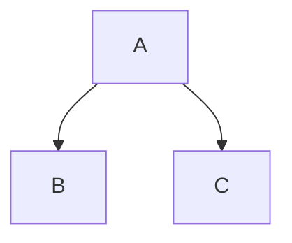

title: Applying Zettlekasten to literate programming
summary: Moving away from hierarchical code organization
date: 2025-06-04 12:00
tags: draft
---

As any programmer will tell you, code organization is paramount for any
non-trivial project. When our code grows too big for a single file, we split it
up into multiple ones. When we have too many files, we put them into folders.
When we have too many folders, we put them in _more_ folders ad infinitum. Where
code is placed in this hierarchy greatly influences a project's overall
structure.

This tree hierarchy feels quite natural. It conceptually fits with abstraction,
where parent modules abstract the capabilities of their children. It's also easy
to implement, leveraging the filesystem for most of the work. But how does it
work in practice?

**TODO** tree diagram indicating how node only uses children



## The sibling dilemma

Essentially every project has code used across multiple modules. Reuse is the
name of the game, and we very commonly need to do the same operation in multiple
places.

> # caption
>
> ```
>
> ```

- Hierarchies lead to conflicts where we want to write code that isn't part of
  the module's interface. Often this code is "utility" code that could be
  applicable beyond the module. If we make this a private function we lead to
  duplication. If we put it in a utility class or a different module we need to
  deal with different code owners.
- How do we have shared private operations, e.g. direct manipulations of data
  structures?
